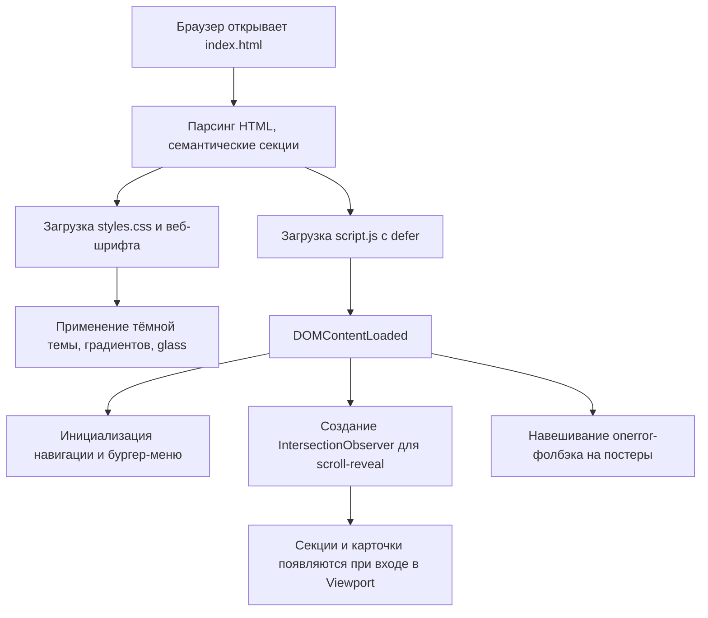
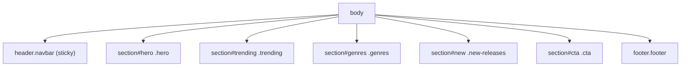

# Design Document

## Overview

Лендинг аниме-сайта — это самодостаточный статический одностраничник, открываемый прямо в браузере (двойным кликом по `index.html`, без сборщика и сервера). Архитектура максимально простая и предсказуемая: три файла (`index.html`, `styles.css`, `script.js`), внешний веб-шрифт через Google Fonts, изображения постеров через публичные CDN-плейсхолдеры с graceful-фолбэком.

Цель дизайна — «вау»-эффект в эстетике 2026 года при минимуме технологий: тёмная палитра, многослойные градиенты, неоновые акценты, glassmorphism, крупная экспрессивная типографика, плавные микро-анимации и анимация появления секций при скролле. Вся «динамика» реализована на ванильном JS без зависимостей.

### Принципы

- **Zero-build, zero-dependency**: только нативные HTML/CSS/JS, чтобы файл открывался напрямую (`file://`).
- **Progressive enhancement**: страница остаётся читаемой и при отключённом JS (контент в разметке статичен), JS лишь добавляет интерактив и анимации.
- **Прогрессивная деградация изображений**: при ошибке загрузки постера показывается градиентный фолбэк с названием.
- **Доступность по умолчанию**: семантические теги, `alt` у изображений, фокус-стили, поддержка `prefers-reduced-motion`.

### Соответствие требованиям (трассируемость)

| Документ требований | Что покрывает дизайн |
|---|---|
| R1 Структура | Семантическая HTML5-разметка, порядок секций, `lang`, `title`, подключение CSS |
| R2 Навигация | Sticky-навбар, якоря, smooth scroll, бургер-меню < 768px |
| R3 Hero | Полноэкранный фон, заголовок/подзаголовок, CTA, анимация появления, hover |
| R4 Trending | Сетка ≥6 карточек, постер/название/жанр/рейтинг, hover-эффект, 1 колонка на мобильном |
| R5 Genres | Заголовок, ≥6 интерактивных чипов, hover |
| R6 New Releases | Заголовок, ≥4 карточки, постер+название |
| R7 CTA | Заголовок, кнопка, hover |
| R8 Footer | Название, ≥3 ссылки, копирайт с годом |
| R9 Тема 2026 | Тёмная палитра, градиенты в ≥2 секциях, glassmorphism, веб-шрифт, единые акценты, scroll-reveal |
| R10 Адаптивность | `viewport`, перестроение в 1 колонку <768, 2 колонки 768–1024, без гориз. скролла от 320px |
| R11 Изображения | `alt`, `loading="lazy"`, фолбэк по `onerror` |

## Architecture

### Файловая структура

```
site anime/
├── index.html        # Разметка всех секций + подключение CSS/шрифтов/JS
├── styles.css        # Тема, layout, компоненты, адаптив, анимации
└── script.js         # Навигация, smooth scroll, бургер, scroll-reveal, фолбэк картинок
```

> Spec-файлы лежат в `site anime/.kiro/specs/anime-landing-page/` и не относятся к рантайму сайта.

### Поток загрузки страницы



### Карта секций (DOM-структура верхнего уровня)



## Components and Interfaces

### 1. Navigation_Bar (`header.navbar`)

- **Структура**: `.nav-inner` → логотип `.logo` (текст «AniWave» + неоновая точка) + `nav.nav-links` (якоря `#trending`, `#genres`, `#new`) + кнопка-бургер `.nav-toggle` (видна < 768px).
- **Поведение**:
  - `position: sticky; top: 0; z-index: 100` — остаётся у верха (R2.4).
  - Glassmorphism-фон: `backdrop-filter: blur(14px)` + полупрозрачный тёмный слой (R9.3).
  - При скролле > 40px добавляется класс `.scrolled` (более плотный фон/тень) — управляется JS.
  - Smooth scroll по якорям через CSS `scroll-behavior: smooth` (R2.3); offset под фикс-навбар через `scroll-margin-top` у секций.
  - Бургер: клик переключает класс `.open` на `nav.nav-links`, меню раскрывается оверлеем; клик по ссылке закрывает меню (R2.5).
- **Интерфейс (JS)**:
  - `initNav()` — навешивает обработчики toggle и закрытия по клику на ссылку; слушает `scroll` для класса `.scrolled`.

### 2. Hero_Section (`section#hero`)

- **Структура**: фоновый слой `.hero-bg` (изображение избранного аниме + затемняющий градиент-оверлей), контент `.hero-content` (бейдж, `h1` заголовок, `p` подзаголовок, группа кнопок `.hero-actions` с primary/secondary), декоративные «орбы» `.orb` для свечения.
- **Поведение**:
  - Фон на всю ширину Viewport, `min-height: 100vh` (R3.3).
  - Анимация появления заголовка/подзаголовка/кнопок: каскадный fade-up через CSS `@keyframes`, длительность каждого ≤ 900ms, общий каскад завершается < 1500ms (R3.5).
  - Кнопка CTA: hover-переход `transition: ... 300ms` (R3.6) — смещение, усиление свечения, сдвиг градиента.
- **Контент**: заголовок-слоган, подзаголовок-описание, primary-кнопка «Смотреть тренды» (якорь на #trending), secondary «Открыть жанры» (#genres).

### 3. Trending_Grid (`section#trending`)

- **Структура**: `.section-head` (надзаголовок + `h2`), сетка `.cards-grid` из элементов `article.anime-card`.
- **Anime_Card**:
  ```
  article.anime-card
    └── .card-media (figure)
         ├── img.card-img[alt, loading="lazy"]
         └── .card-fallback (скрытый по умолчанию, показывается при onerror)
    └── .card-rating (бейдж со звездой + число, поверх медиа)
    └── .card-body
         ├── h3.card-title
         └── .card-genre
  ```
- **Данные**: статический массив из ≥6 аниме прямо в HTML (название, жанр, рейтинг, URL постера). Минимум 6 карточек (R4.2), каждая показывает постер/название/жанр/рейтинг (R4.3).
- **Поведение**:
  - Hover: `transform: translateY(-8px)` + усиление тени/градиентной рамки + лёгкий zoom постера, `transition 300ms` (R4.4).
  - Сетка: `grid-template-columns: repeat(auto-fill, minmax(220px, 1fr))` на десктопе; 1 колонка < 768px (R4.5); 2 колонки в 768–1024px (R10.3).

### 4. Genre_Section (`section#genres`)

- **Структура**: `.section-head` + `.genre-grid` из `a.genre-chip` (≥6 жанров: Сёнэн, Сэйнэн, Романтика, Фэнтези, Меха, Спокон, Психология, Сёдзё...).
- **Поведение**: каждый чип — glass-элемент с акцентной рамкой; hover меняет фон/границу/свечение за 300ms (R5.3). Градиентный фон секции (R9.2).
- Чип содержит эмодзи/иконку-символ + название для визуального разнообразия.

### 5. New_Releases_Section (`section#new`)

- **Структура**: `.section-head` + `.releases-row` из ≥4 `article.release-card`.
- **Release_Card**: упрощённая карточка — `.card-media` с `img` (`alt`, `loading="lazy"`) + `.card-fallback`, бейдж «NEW», `h3` название (R6.2, R6.3).
- **Поведение**: hover-подсветка, lazy-loading постеров (ниже первого экрана → R11.2).

### 6. CTA_Section (`section#cta`)

- **Структура**: glass-панель с ярким градиентным фоном, `h2` призывный заголовок, `p` подпись, кнопка `.btn-primary`.
- **Поведение**: hover-кнопки за 300ms (R7.3); крупный градиент + светящиеся орбы (R9.2).

### 7. Footer (`footer.footer`)

- **Структура**: `.footer-inner` → бренд-блок (название + слоган), колонки ссылок (Навигация / Сообщество / Соцсети — ≥3 ссылки суммарно), нижняя строка `.footer-bottom` с копирайтом.
- **Копирайт**: год вставляется JS-ом (`new Date().getFullYear()`) в `<span id="year">`, с фолбэком статического года в разметке (R8.3).

## Data Models

Данные статичны и хранятся прямо в HTML-разметке (требование: без бэкенда). Концептуальная модель карточки:

```
AnimeCard {
  title:   string   // название аниме
  genre:   string   // основной жанр (для trending)
  rating:  number   // 0.0–10.0 (для trending)
  poster:  string   // URL изображения постера (CDN-плейсхолдер)
  alt:     string   // альтернативный текст = "Постер аниме <title>"
  badge?:  "NEW"     // только для new-releases
}

Genre {
  name:   string     // название жанра
  icon:   string     // эмодзи/символ
  href:   "#"        // презентационная ссылка
}
```

### Источник изображений

Используются публичные плейсхолдеры (например, `picsum.photos` с сидом для стабильности кадра), чтобы страница выглядела наполненной без локальных ассетов. Каждый `img` имеет:
- `alt` = осмысленное описание (R11.1),
- `loading="lazy"` для постеров ниже hero (R11.2),
- `onerror`-хендлер → класс `.img-failed` на родителе показывает `.card-fallback` (R11.3).

> Альтернатива/риск: внешние плейсхолдеры требуют интернет. Фолбэк-слой гарантирует, что даже офлайн карточки выглядят осмысленно (градиент + название), а не «битой картинкой».

## Visual Theme (стиль 2026)

### Дизайн-токены (CSS Custom Properties в `:root`)

```
--bg-900: #07060d        /* основной тёмный фон */
--bg-800: #0d0b1a        /* поверхности */
--glass: rgba(255,255,255,.06)   /* стеклянный слой */
--glass-border: rgba(255,255,255,.12)
--text-100: #f4f2ff      /* основной текст */
--text-300: #b8b3d6      /* вторичный текст */
--accent-1: #7c3aed      /* фиолетовый */
--accent-2: #06b6d4      /* циан */
--accent-3: #f43f5e      /* розово-красный */
--grad-hero: linear/radial mix из accent-1/2/3
--radius: 18px
--shadow-glow: 0 0 40px rgba(124,58,237,.35)
```

- **Тёмная палитра** как основной фон (R9.1).
- **Градиенты** минимум в Hero, CTA и фоне секций жанров (≥2 → R9.2).
- **Glassmorphism**: навбар, карточки, чипы жанров, CTA-панель используют `backdrop-filter: blur()` + полупрозрачный фон + светлая рамка (R9.3).
- **Шрифты** (R9.4): заголовки — выразительный дисплейный шрифт (например, «Space Grotesk» / «Sora» / «Clash»-подобный через Google Fonts), текст — «Inter». Подключение через `<link>` в `<head>` + `font-display: swap`.
- **Единые акценты**: все интерактивные элементы (ссылки, кнопки, чипы, рейтинги) используют общую акцентную палитру `--accent-*` (R9.5).
- **Декор**: размытые градиентные «орбы» (псевдоэлементы/divы с `filter: blur`), тонкая зернистость/grid-overlay для глубины, неоновое свечение на hover.

### Анимации

| Анимация | Механизм | Длительность |
|---|---|---|
| Появление hero-заголовка (каскад) | CSS `@keyframes fadeUp` + `animation-delay` | каждый ≤900ms, каскад <1500ms (R3.5) |
| Hover кнопок/карточек/чипов | CSS `transition` | 300ms (R3.6, R4.4, R5.3, R7.3) |
| Scroll-reveal секций | IntersectionObserver добавляет `.in-view` → CSS transition | ~600ms (R9.6) |
| Плавный скролл по якорям | CSS `scroll-behavior: smooth` | — (R2.3) |
| Парение орбов | CSS `@keyframes float` (бесконечный, мягкий) | декоративно |

- Поддержка `@media (prefers-reduced-motion: reduce)`: отключение/упрощение анимаций для доступности.

## Responsive Design

`<meta name="viewport" content="width=device-width, initial-scale=1">` (R10.1).

| Breakpoint | Поведение |
|---|---|
| `< 768px` (mobile) | Навигация → бургер-меню; все сетки и секции в 1 колонку (R2.5, R4.5, R10.2); уменьшенная типографика hero |
| `768px – 1024px` (tablet) | Сетки карточек ≥2 колонки (R10.3); навбар — полное меню |
| `> 1024px` (desktop) | Сетки 3–4 колонки (`auto-fill minmax`); максимальная ширина контента ограничена `max-width` контейнера |

- Все контейнеры используют `max-width` + `margin-inline: auto` + боковые `padding`.
- Глобально `overflow-x: hidden` на `body` и `box-sizing: border-box`, отсутствие фикс-ширин больше вьюпорта → нет горизонтального скролла от 320px (R10.4).
- Изображения `max-width: 100%`, медиа карточек с фиксированным `aspect-ratio` для стабильной сетки.

## JavaScript Interfaces (`script.js`)

Без зависимостей. Инициализация после `DOMContentLoaded`. Основные функции:

```
initNav()
  - toggle бургер-меню (.nav-toggle → .nav-links.open)
  - закрытие меню по клику на ссылку
  - добавление .scrolled навбару при window.scrollY > 40

initScrollReveal()
  - IntersectionObserver(threshold ~0.15)
  - при пересечении добавляет .in-view целевым [data-reveal] элементам
  - unobserve после появления (одноразово)
  - если IntersectionObserver недоступен → сразу показать всё (фолбэк)

initImageFallback()
  - для каждого img.card-img: onerror → родителю .card-media добавить .img-failed
  - (фон + текст .card-fallback становятся видимыми)

setYear()
  - document.getElementById('year').textContent = new Date().getFullYear()
```

> Все функции защищены проверками на наличие элементов, чтобы не падать при изменении разметки.

## Error Handling

| Сценарий | Обработка |
|---|---|
| Постер не загрузился | `onerror` → `.img-failed` показывает градиентный фолбэк с названием (R11.3) |
| JS отключён | Контент полностью в разметке; секции видимы (reveal-элементы имеют видимое базовое состояние через `.no-js`/отсутствие скрытия по умолчанию); навигация работает через нативные якоря; копирайт-год имеет статический фолбэк |
| `IntersectionObserver` не поддерживается | Фолбэк: все секции сразу `.in-view` |
| `backdrop-filter` не поддерживается | Фолбэк-фон с повышенной непрозрачностью (через `@supports`) |
| Нет интернета (внешний шрифт/картинки) | Системный шрифт-фолбэк в `font-family`; фолбэк-слой карточек |

### Доступность

- Семантические теги: `header`, `nav`, `main`/`section`, `article`, `footer`, корректная иерархия заголовков `h1→h2→h3`.
- `alt` у всех постеров; декоративные орбы — `aria-hidden`.
- Бургер-кнопка: `aria-label`, `aria-expanded`, переключаемое JS.
- Видимые `:focus-visible` стили для клавиатурной навигации.
- Достаточный контраст текста на тёмном фоне.

## Correctness Properties

Поскольку проект статический и презентационный (без вычислительной логики и пользовательских данных), формальные свойства носят характер структурных и визуальных инвариантов, проверяемых вручную.

### Property 1: Полнота и порядок секций
Для любой загрузки страницы DOM содержит ровно 7 верхнеуровневых секций (Navigation_Bar, Hero, Trending, Genres, New Releases, CTA, Footer) в заданном сверху-вниз порядке.
**Validates: Requirements 1.3**
Проверка: инспекция DOM.

### Property 2: Минимальные количества элементов
Trending_Grid содержит ≥6 `article.anime-card`; Genre_Section ≥6 чипов; New_Releases ≥4 карточки; Footer ≥3 ссылки. Инвариант не нарушается при любом размере экрана.
**Validates: Requirements 4.2, 5.2, 6.2, 8.2**
Проверка: подсчёт элементов в DOM.

### Property 3: Полнота данных карточки
Каждая trending-карточка одновременно содержит постер (`img` или фолбэк), название, жанр и рейтинг — ни одно поле не пустое.
**Validates: Requirements 4.3**
Проверка: инспекция содержимого карточек.

### Property 4: Взаимоисключающий фолбэк изображения
Для любого `img` постера выполняется ровно одно из двух состояний — показано изображение ЛИБО показан фолбэк; «битой картинки» без подписи не возникает ни при каком исходе загрузки.
**Validates: Requirements 11.3**
Проверка: эмуляция ошибки загрузки (подмена URL на битый).

### Property 5: Инвариант горизонтального скролла
Для любой ширины Viewport ≥ 320px ширина содержимого не превышает ширину Viewport (нет горизонтальной прокрутки).
**Validates: Requirements 10.4**
Проверка: изменение ширины окна в DevTools, контроль `document.scrollingElement.scrollWidth`.

### Property 6: Монотонность колонок по брейкпоинтам
Число колонок сеток не убывает с ростом ширины — 1 колонка (<768px) ≤ 2 колонки (768–1024px) ≤ 3–4 колонки (>1024px).
**Validates: Requirements 4.5, 10.2, 10.3**
Проверка: изменение ширины окна и подсчёт колонок.

### Property 7: Ограничение длительности анимаций интерактива
Любой hover-переход интерактивного элемента завершается за 300ms, а анимация появления hero-заголовка — за <1500ms.
**Validates: Requirements 3.5, 3.6, 4.4, 5.3, 7.3**
Проверка: измерение transition/animation-duration в DevTools.

### Property 8: Единство акцентной палитры
Множество цветов, применяемых к интерактивным элементам (ссылки/кнопки/чипы/рейтинги), является подмножеством объявленных `--accent-*` токенов.
**Validates: Requirements 9.5**
Проверка: инспекция вычисленных стилей.

### Property 9: Корректность якорной навигации
Каждый якорь навбара ссылается на `id` существующей секции; клик прокручивает именно к ней.
**Validates: Requirements 2.2, 2.3**
Проверка: сопоставление `href` якорей с `id` секций.

### Property 10: Устойчивость к отключённому JS
При отсутствии JS весь контент остаётся видимым и доступным (reveal-элементы не остаются скрытыми навсегда), навигация по якорям работает.
**Validates: Requirements 11.2**
Проверка: отключение JavaScript в браузере.

## Testing Strategy

Проект статический, без тест-раннера. Проверка — ручная/визуальная по чек-листам, привязанным к требованиям.

### Функциональные проверки

1. **Структура (R1)**: открыть `index.html` напрямую; убедиться, что все 7 секций присутствуют и идут в заданном порядке; валидность разметки; `lang` и `title` заданы.
2. **Навигация (R2)**: клик по якорям плавно скроллит к секциям; навбар остаётся сверху при скролле; на ширине < 768px появляется бургер и меню раскрывается/закрывается.
3. **Hero (R3)**: при загрузке заголовок появляется анимацией < 1500ms; фон на всю ширину; hover кнопки меняет вид за 300ms.
4. **Trending (R4)**: ≥6 карточек; у каждой постер/название/жанр/рейтинг; hover-эффект; 1 колонка на мобильном.
5. **Genres (R5)**: заголовок + ≥6 чипов; hover за 300ms.
6. **New Releases (R6)**: заголовок + ≥4 карточки с постером и названием.
7. **CTA (R7)**: заголовок + кнопка; hover за 300ms.
8. **Footer (R8)**: название, ≥3 ссылки, копирайт с актуальным годом.
9. **Тема (R9)**: тёмный фон; градиенты в ≥2 секциях; glass хотя бы на одном типе элементов; кастомный шрифт заголовков; единые акценты; reveal секций при скролле.
10. **Адаптивность (R10)**: проверить на 320 / 375 / 768 / 1024 / 1440px — нет горизонтального скролла; перестроение колонок согласно брейкпоинтам.
11. **Изображения (R11)**: у постеров есть `alt`; ниже hero — `loading="lazy"`; при подмене битого URL появляется фолбэк.

### Инструменты проверки

- DevTools Device Toolbar для брейкпоинтов и отсутствия горизонтального скролла.
- Lighthouse (по возможности) для общей оценки доступности/производительности.
- Эмуляция офлайна/битых картинок для проверки фолбэков.
