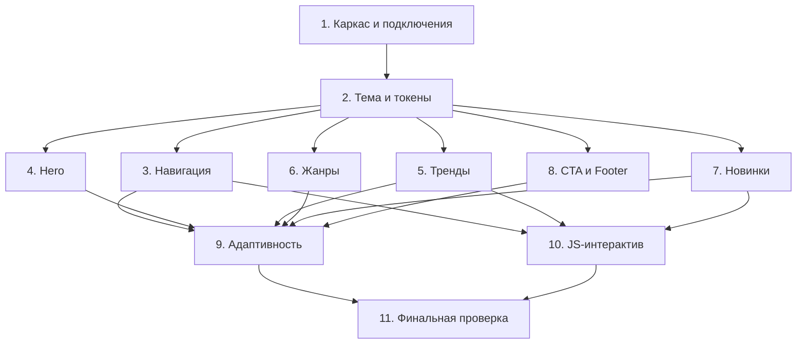

# Implementation Plan

## Overview

План реализации статического аниме-лендинга из трёх файлов (`index.html`, `styles.css`, `script.js`) в папке `site anime`. Задачи идут инкрементально: сначала каркас и тема, затем секции сверху вниз, после — адаптивность, JS-интерактив и финальная проверка. Каждая задача ссылается на конкретные требования.

## Task Dependency Graph



```json
{
  "waves": [
    { "wave": 1, "tasks": ["1"] },
    { "wave": 2, "tasks": ["2"] },
    { "wave": 3, "tasks": ["3", "4", "5", "6", "7", "8"] },
    { "wave": 4, "tasks": ["9", "10"] },
    { "wave": 5, "tasks": ["11"] }
  ]
}
```

## Tasks

- [x] 1. Создать каркас страницы и подключения
  - Создать `site anime/index.html` с валидной HTML5-структурой: `<!DOCTYPE html>`, `<html lang="ru">`, `<head>` с `<meta charset>`, метатегом `viewport`, `<title>`, подключением Google Fonts (дисплейный шрифт для заголовков + Inter) и `<link rel="stylesheet" href="styles.css">`, `<body>` с подключением `<script src="script.js" defer>`.
  - Добавить пустые семантические контейнеры всех 7 секций в правильном порядке: `header.navbar`, `section#hero`, `section#trending`, `section#genres`, `section#new`, `section#cta`, `footer.footer`.
  - Создать пустые файлы `site anime/styles.css` и `site anime/script.js`.
  - _Requirements: 1.1, 1.2, 1.3, 1.4, 1.5, 10.1_

- [x] 2. Заложить тему и дизайн-токены в CSS
  - В `styles.css` объявить `:root` с CSS-переменными (фоны, текст, акценты `--accent-1/2/3`, радиусы, тени-свечения, градиенты).
  - Добавить базовый сброс (`box-sizing: border-box`, сброс margin), тёмный фон `body`, `overflow-x: hidden`, базовую типографику (display-шрифт для заголовков, Inter для текста, `font-display: swap`-фолбэк через системные шрифты), глобальный контейнер `max-width` + центрирование, плавный скролл `scroll-behavior: smooth`, стили `:focus-visible`.
  - Добавить утилитарные классы для секций, заголовков `.section-head`, кнопок `.btn-primary`/`.btn-secondary` (с hover-переходом 300ms) и glass-поверхности.
  - _Requirements: 9.1, 9.2, 9.4, 9.5, 10.4_

- [x] 3. Реализовать навигацию (Navigation_Bar)
  - В `index.html` наполнить `header.navbar`: логотип/название «AniWave», ссылки-якоря на `#trending`, `#genres`, `#new`, кнопку-бургер `.nav-toggle` с `aria-label`/`aria-expanded`.
  - В `styles.css` стилизовать sticky-навбар с glassmorphism (`backdrop-filter: blur`, полупрозрачный фон, светлая рамка), `position: sticky; top: 0`, класс `.scrolled` для уплотнения фона, скрытие бургера на десктопе.
  - Добавить `scroll-margin-top` секциям для корректной прокрутки под фикс-навбар.
  - _Requirements: 2.1, 2.2, 2.3, 2.4, 9.3_

- [x] 4. Реализовать Hero-секцию
  - В `index.html` наполнить `section#hero`: фоновый слой `.hero-bg` (изображение избранного аниме с градиентным оверлеем), декоративные орбы `.orb` (`aria-hidden`), `.hero-content` с бейджем, `h1`-слоганом, `p`-подзаголовком, группой кнопок `.hero-actions` (primary → #trending, secondary → #genres).
  - В `styles.css` задать `min-height: 100vh`, фон на всю ширину, градиентный оверлей, каскадную анимацию появления `@keyframes fadeUp` с `animation-delay` (каскад завершается <1500ms), плавающие орбы, hover-состояния кнопок (300ms).
  - _Requirements: 3.1, 3.2, 3.3, 3.4, 3.5, 3.6, 9.2_

- [x] 5. Реализовать секцию трендов (Trending_Grid)
  - В `index.html` добавить `.section-head` с заголовком и сетку `.cards-grid` с минимум 6 `article.anime-card`; каждая карточка: `.card-media` с `img.card-img` (`alt`, `loading="lazy"`) и скрытым `.card-fallback`, бейдж рейтинга `.card-rating`, `.card-body` с `h3.card-title` и `.card-genre`. Заполнить статичными данными (название, жанр, рейтинг, URL постера-плейсхолдера).
  - В `styles.css` стилизовать сетку (`repeat(auto-fill, minmax(...))`), glass-карточки, фиксированный `aspect-ratio` медиа, hover-эффект (`translateY`, свечение, zoom постера) за 300ms, стили фолбэк-слоя `.img-failed .card-fallback`.
  - _Requirements: 4.1, 4.2, 4.3, 4.4, 9.3, 11.1, 11.2_

- [x] 6. Реализовать секцию жанров (Genre_Section)
  - В `index.html` добавить `.section-head` и `.genre-grid` с минимум 6 чипами `a.genre-chip` (иконка-эмодзи + название жанра).
  - В `styles.css` задать градиентный фон секции, glass-чипы с акцентной рамкой, hover-смену состояния (фон/граница/свечение) за 300ms.
  - _Requirements: 5.1, 5.2, 5.3, 9.2, 9.3_

- [x] 7. Реализовать секцию новинок (New_Releases_Section)
  - В `index.html` добавить `.section-head` и `.releases-row` с минимум 4 `article.release-card`; каждая: `.card-media` с `img` (`alt`, `loading="lazy"`) + `.card-fallback`, бейдж «NEW», `h3` с названием.
  - В `styles.css` стилизовать ряд/сетку релизов, hover-подсветку, фолбэк-слой.
  - _Requirements: 6.1, 6.2, 6.3, 11.1, 11.2_

- [x] 8. Реализовать CTA-секцию и Footer
  - В `index.html` наполнить `section#cta`: glass-панель с градиентным фоном, орбами, призывным `h2`, подписью и кнопкой `.btn-primary`. Наполнить `footer.footer`: название сайта, ≥3 ссылки (колонки навигации/сообщества/соцсетей), строка копирайта со `<span id="year">` и статическим фолбэк-годом.
  - В `styles.css` стилизовать CTA (крупный градиент, свечение, hover кнопки 300ms) и footer (сетка колонок, разделитель, `.footer-bottom`).
  - _Requirements: 7.1, 7.2, 7.3, 8.1, 8.2, 8.3, 9.2, 9.3_

- [x] 9. Реализовать адаптивность
  - В `styles.css` добавить медиа-запросы: `< 768px` — бургер-меню (раскрытие `.nav-links.open` оверлеем), все сетки и секции в 1 колонку, уменьшенная типографика hero; `768px–1024px` — сетки карточек в 2 колонки; `> 1024px` — 3–4 колонки.
  - Проверить отсутствие горизонтального скролла на 320/375/768/1024/1440px (изображения `max-width: 100%`, нет фикс-ширин больше вьюпорта).
  - Добавить `@media (prefers-reduced-motion: reduce)` для упрощения анимаций и `@supports` фолбэк для `backdrop-filter`.
  - _Requirements: 2.5, 4.5, 10.2, 10.3, 10.4_

- [x] 10. Реализовать JavaScript-интерактив
  - В `script.js` после `DOMContentLoaded` реализовать: `initNav()` (toggle бургера с обновлением `aria-expanded`, закрытие меню по клику на ссылку, класс `.scrolled` навбару при `scrollY > 40`); `initScrollReveal()` (IntersectionObserver добавляет `.in-view` элементам `[data-reveal]`, с фолбэком «показать всё» при отсутствии API); `initImageFallback()` (`onerror` постеров → `.img-failed` на `.card-media`); `setYear()` (вставка `new Date().getFullYear()` в `#year`).
  - В `index.html` разметить секции/карточки атрибутом `data-reveal`; в `styles.css` задать скрытое исходное и видимое `.in-view` состояния reveal-элементов с переходом ~600ms.
  - _Requirements: 9.6, 11.3_

- [-] 11. Финальная проверка и полировка
  - Открыть `index.html` в браузере и пройти чек-лист: порядок 7 секций; навигация и smooth scroll; sticky-навбар; бургер на мобильном; анимация hero; ≥6 trending-карточек с постером/названием/жанром/рейтингом; ≥6 жанров; ≥4 новинки; CTA; футер с ≥3 ссылками и годом; тёмная тема, градиенты, glass, веб-шрифт, scroll-reveal.
  - Проверить адаптив на ключевых ширинах (320–1440px) на отсутствие горизонтального скролла и корректность колонок; проверить фолбэк изображений (подмена битого URL); проверить корректность всех якорей (`href` ↔ `id`).
  - Исправить найденные визуальные/функциональные дефекты.
  - _Requirements: 1.3, 2.2, 2.3, 4.5, 9.6, 10.2, 10.3, 10.4, 11.3_

## Notes

- Проект статический, без сборщика и сервера: файлы открываются напрямую в браузере (`file://`).
- Изображения постеров — внешние плейсхолдеры (CDN); на случай офлайна/ошибки предусмотрен градиентный фолбэк-слой с названием.
- Веб-шрифты подключаются через Google Fonts с системным фолбэком в `font-family`.
- Тестирование ручное/визуальное по чек-листам из design.md (раздел Testing Strategy и Correctness Properties).
- Задачи 3–8 зависят только от темы (задача 2) и могут выполняться в любом порядке относительно друг друга.
